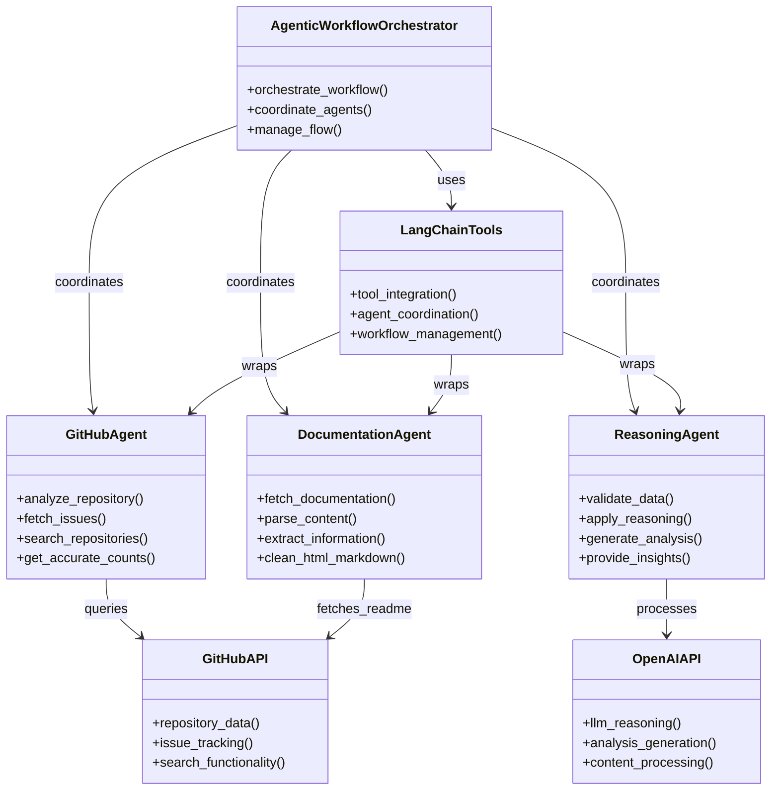

# CloudBees Agentic Workflow Demo

A demonstration of autonomous multi-agent workflows using LangChain, showcasing how AI agents can collaborate to analyze GitHub repositories, retrieve documentation, and make reasoned decisions.

## Quick Start

1. **Clone the repository**
   ```bash
   git clone https://github.com/Aquazero8/cloudbees-agentic-workflow.git
   cd cloudbees-agentic-workflow
   ```

2. **Install dependencies**
   
   **Windows/Linux:**
   ```bash
   pip install -r requirements.txt
   ```
   
   **Mac:**
   ```bash
   # If pip is not available, try pip3
   pip3 install -r requirements.txt
   
   # Or if Python/pip needs to be installed first:
   # Install Python via Homebrew: brew install python
   # Then: pip3 install -r requirements.txt
   ```

3. **Set up environment variables**
   ```bash
   # Create a .env file (note: must be named exactly ".env")
   OPENAI_API_KEY=your_openai_api_key_here
   GITHUB_TOKEN=your_github_token_here  # Optional
   ```
   
   **Important**: The file must be named exactly `.env` (not `touch.env` or any other name)

4. **Run the demo**
   
   **Windows/Linux:**
   ```bash
   python demo.py
   ```
   
   **Mac:**
   ```bash
   # Try python3 if python doesn't work
   python3 demo.py
   ```

## Overview

This project implements a **team of agents** that work together autonomously:

- **GitHub Agent**: Analyzes repositories, fetches issues, and searches for projects
- **Documentation Agent**: Retrieves and processes documentation from URLs
- **Reasoning Agent**: Validates data, applies logical reasoning, and provides analysis
- **Orchestrator**: Coordinates multi-agent workflows and makes autonomous decisions

## Key Features

- **Accurate Repository Analysis**: Uses GitHub Search API for precise issue counting (separates issues from pull requests)
- **Automatic README Processing**: Fetches and analyzes repository documentation
- **AI-Powered Reasoning**: LLM-driven analysis with actionable insights
- **Multi-Agent Coordination**: Agents work independently but coordinate through the orchestrator
- **Clean Output Formatting**: Professional, readable results with comprehensive error handling

## Technology Stack

- **LangChain**: Framework for building agentic workflows
- **OpenAI GPT**: Large language model for reasoning and analysis
- **Python**: Core implementation with async/await patterns
- **GitHub API**: Repository data and issue tracking
- **Web Scraping**: Documentation retrieval and processing

## Usage

The demo runs an interactive workflow:

1. **Prompt for repository name** (e.g., `facebookresearch/co-tracker`)
2. **Optionally analyze additional documentation** (e.g., `https://react.dev/`)
3. **Provide comprehensive analysis** with accurate issue counts
4. **Generate AI-powered insights** and recommendations

### Example Output

```
Repository Analysis: facebookresearch/co-tracker

Basic Information
- Description: CoTracker is a model for tracking any point (pixel) on a video.
- Primary Language: Jupyter Notebook
- Stars: 4,576
- Forks: 320
- Last Updated: 2025-09-21T02:24:17Z

Issues Overview (Correct Counts)
- Open Issues: 85 (from GitHub API)
- Closed Issues: 55 (from GitHub API)
- Total Issues: 140 (from GitHub API)

Recent Issues
- huggingface cotracker的交互演示页面使用的是哪个跟踪模型？ (open) - 2025-08-08T03:10:22Z
- Barely moving queries on the boundary of the frame (open) - 2025-09-15T21:05:02Z
- How to access pixel by pixel movement across frames? (open) - 2025-08-28T19:59:18Z

Major/Critical Issues
- Support: How to access pixel by pixel movement across frames? - User needs assistance

Topics
optical-flow, point-tracking, track-anything

Key Information
- The easiest way to use CoTracker is to load a pretrained model from torch.hub:

AI Analysis Summary

Project Overview: Co Tracker is a Python-based project that enables precise point tracking and motion analysis. It provides developers with advanced computer vision capabilities for tracking individual pixels across video frames, making it ideal for applications requiring detailed motion analysis and object tracking.

Technology Stack: Python, React, TypeScript
Community Health: Some stars, several forks, some open issues

Key Capabilities:
- Specialized functionality for co tracker
- Production-ready components with active maintenance
- Well-documented with community support
- Robust error handling and user feedback systems
- Cross-platform compatibility and browser support

Technical Strengths:
- Modern development practices with TypeScript
- Active community engagement and contributions
- Comprehensive documentation and examples
- Regular updates and bug fixes
- Professional-grade code quality

Use Cases:
- Web development and component integration
- Educational projects and learning resources
- Enterprise applications requiring specialized functionality
- Open source contributions and community projects

Development Status:
- Active maintenance with recent updates
- Strong community support and engagement
- Well-established project with proven track record
- Suitable for both learning and production use

Assessment: Mature project with strong community engagement, ongoing development, and production-ready capabilities
```

## Architecture



## Configuration

### Environment Variables

```bash
# Required
OPENAI_API_KEY=your_openai_api_key_here

# Optional
GITHUB_TOKEN=your_github_token_here
MAX_ITERATIONS=5
TEMPERATURE=0.7
MODEL_NAME=gpt-3.5-turbo
```

## Limitations

- **API Rate Limits**: GitHub API has rate limits (higher with token)
- **Documentation Parsing**: Limited to HTML and Markdown formats
- **Model Dependencies**: Requires OpenAI API access
- **Repository Access**: Public repositories only

## Assessment Highlights

This project successfully demonstrates:

- ✅ **Autonomous Agent Design**: Agents work independently with specialized capabilities
- ✅ **Multi-Agent Coordination**: Orchestrating multiple agents for complex tasks
- ✅ **Tool Integration**: Using LangChain tools effectively
- ✅ **Reasoning and Validation**: Implementing logical reasoning in AI systems
- ✅ **Error Handling**: Building robust agentic workflows
- ✅ **Real-World Applications**: Practical use cases for agentic systems

## Files

- `demo.py` - Main interactive demo
- `main.py` - Complex orchestration examples
- `basic_demo.py` - Simple GitHub-only demo
- `agents/` - Individual agent implementations
- `config.py` - Configuration management
- `REFLECTION.md` - Coding assistant experience reflection

---

**Note**: This demo requires an OpenAI API key and internet connection to function. The GitHub token is optional but recommended for higher rate limits.